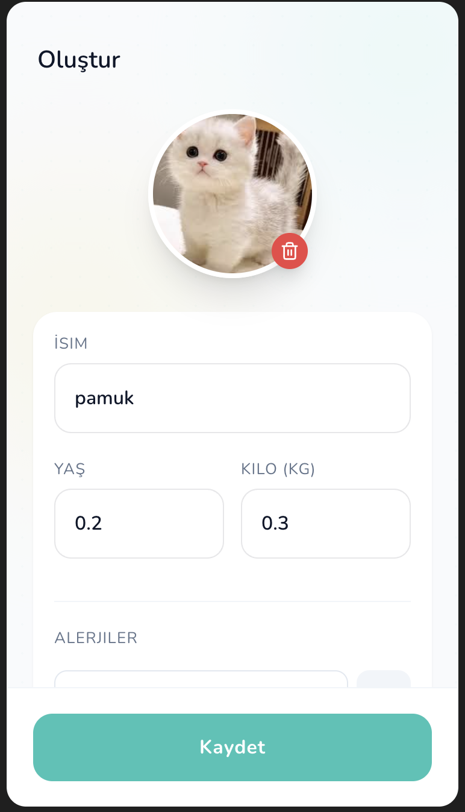
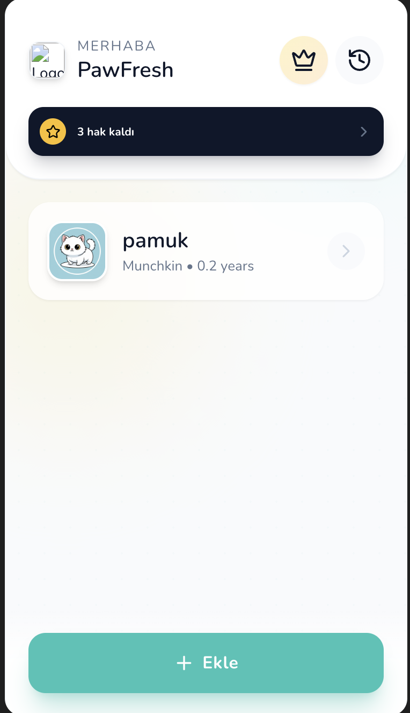
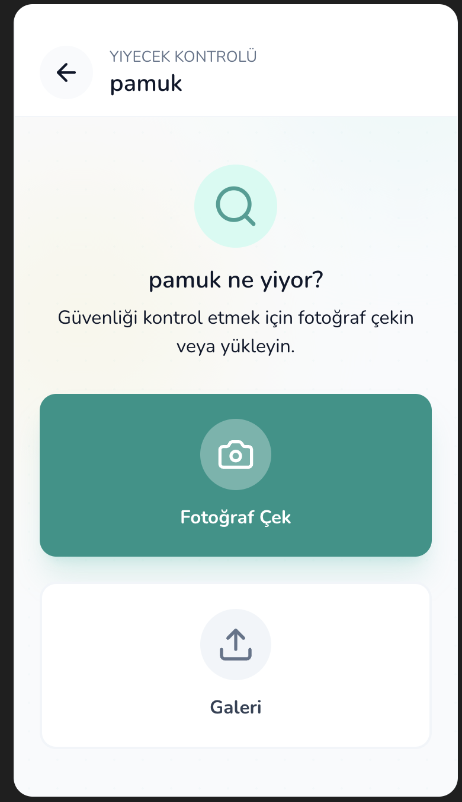
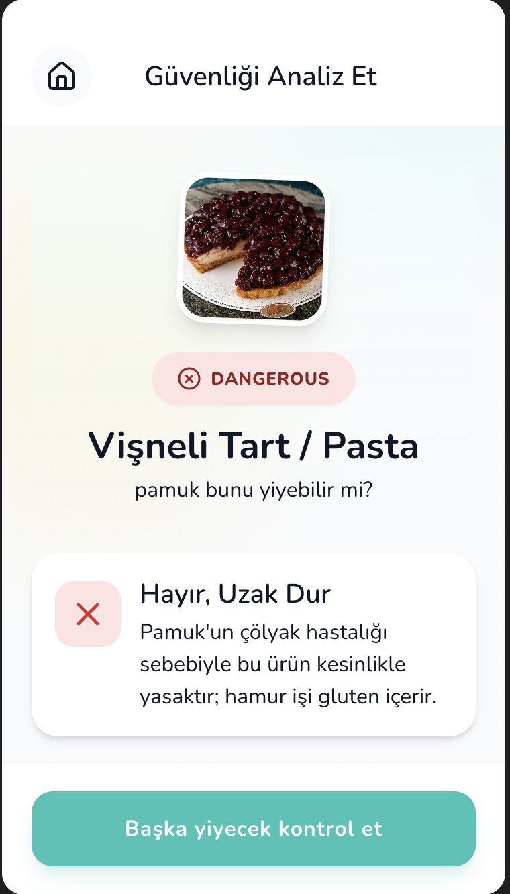

# PawFresh 🐾

**PawFresh** is an AI-powered mobile web application designed to help pet owners instantly determine if specific foods are safe for their furry friends. By leveraging the power of Google's Gemini Vision API, PawFresh analyzes photos of food and cross-references them with your pet's specific profile, allergies, and health conditions.

<p align="center">
  
</p>

---

## 📱 How It Works

PawFresh makes keeping your pet safe as easy as taking a photo. Here is the typical user journey:

<table border="0">
  <tr>
    <td width="50%" align="center">
      <h3>1. Create Pet Profile</h3>
      
      <p>Upload a photo of your pet. The AI automatically detects the <strong>species and breed</strong>. You simply add their name, age, weight, and any specific allergies (e.g., Gluten) or conditions.</p>
    </td>
    <td width="50%" align="center">
      <h3>2. Your Dashboard</h3>
      
      <p>View all your pets in one place. Access your search history, check your remaining free credits, or manage multiple pet profiles easily.</p>
    </td>
  </tr>
  <tr>
    <td width="50%" align="center">
      <h3>3. Scan Food</h3>
      
      <p>Wondering <em>"Can Pamuk eat this?"</em> simply tap to open the camera or upload a photo from your gallery. The app prepares the image for analysis.</p>
    </td>
    <td width="50%" align="center">
      <h3>4. Instant Analysis</h3>
      
      <p><strong>Get a clear Yes/No answer.</strong> The AI explains <em>why</em> it is dangerous based on your specific pet's health context (e.g., this tart contains gluten which conflicts with the pet's condition).</p>
    </td>
  </tr>
</table>

---

## ✨ Key Features

### 🧠 AI-Powered Analysis
*   **Visual Recognition:** Take a photo of any food item, and the app identifies it instantly using Gemini 2.5/3.0 models.
*   **Contextual Safety:** It doesn't just say "Safe" or "Toxic." It analyzes the food in the context of *your* pet (Species, Age, Weight).
*   **Health & Allergy Checks:** Automatically flags foods that conflict with your pet's specific allergies (e.g., Chicken) or health conditions (e.g., Diabetes).

### 🐶 Smart Pet Profiles
*   **AI Profile Creation:** Upload a photo of your pet, and the AI automatically detects the species (Dog/Cat) and breed.
*   **Generative Avatars:** Creates a custom, stylized sticker-style portrait of your pet for their profile.
*   **Medical Details:** Store weight, age, and specific medical notes for accurate advice.

### 📱 User Experience
*   **Freemium Model:** Includes a credit system for free users and a simulated "Pro" subscription flow (StoreKit style) for unlimited access.
*   **History Tracking:** All scans are saved locally so you can revisit previous checks.
*   **Multi-Language Support:** Fully localized in **English, German, Spanish, and Turkish**.
*   **Tablet Support:** Responsive design that adapts gracefully from iPhone screens to iPad/Tablet layouts.

---

## 🛠 Tech Stack

*   **Framework:** React 19
*   **Styling:** Tailwind CSS (Mobile-first, Custom Theme)
*   **AI Provider:** Google Gemini API (`@google/genai` SDK)
    *   *Reasoning:* `gemini-3-pro-preview`
    *   *Vision/Image:* `gemini-2.5-flash-image`
*   **Icons:** Lucide React
*   **Storage:** IndexedDB (via native API) for offline-capable data persistence.
*   **Build/Runtime:** ES Modules (via `esm.sh` for rapid prototyping/deployment).

---

## 🚀 Run Configurations

### Prerequisites
1.  **Node.js** (v18 or higher recommended).
2.  A **Google Gemini API Key**. You can get one at [aistudio.google.com](https://aistudio.google.com/).

### Installation

1.  **Clone the repository:**
    ```bash
    git clone https://github.com/yourusername/pawfresh.git
    cd pawfresh
    ```

2.  **Install Dependencies:**
    ```bash
    npm install
    ```

3.  **Environment Setup:**
    Create a `.env` file in the root directory. You must configure your API Key here.
    
    *Note: The application expects `process.env.API_KEY` to be available.*

    ```env
    API_KEY=your_actual_gemini_api_key_here
    ```

    *If you are using Vite, you may need to update the code to use `import.meta.env.VITE_API_KEY` or configure your bundler to define `process.env.API_KEY`.*

4.  **Add Assets:**
    Ensure you have a `logo.png` file in your public/root directory for the branding to load correctly.

### Running Development Server

```bash
npm run dev
```

Open your browser to `http://localhost:5173` (or the port shown in your terminal).

### building for Production

```bash
npm run build
```

---

## 🧪 Simulation Features

*   **Paywall & Payment:** The app includes a robust mock payment service (`services/paymentService.ts`). It simulates network latency, user cancellation, and success states. It does **not** process real credit cards.
*   **Camera:** The app uses a browser-based camera implementation. Ensure your device/browser allows camera permissions.

## ⚠️ Disclaimer

This application is powered by Artificial Intelligence. While highly advanced, AI can make mistakes. **Always consult a professional veterinarian** in medical emergencies or if you are unsure about a specific food item. This app is an advisory tool, not a medical device.

---

**PawFresh** — Keep them safe, one treat at a time. 🦴
